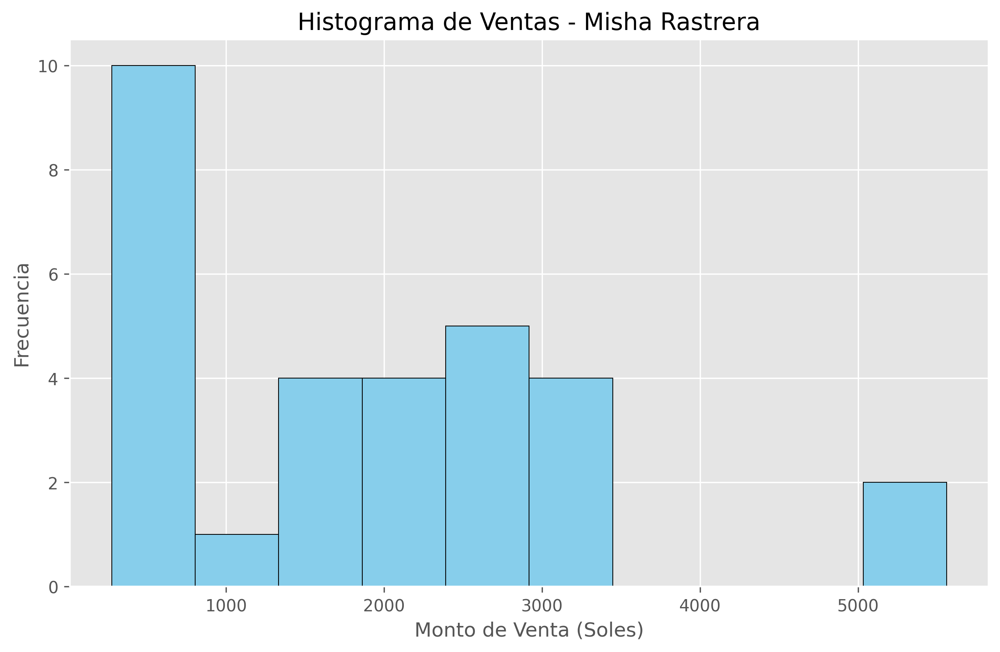
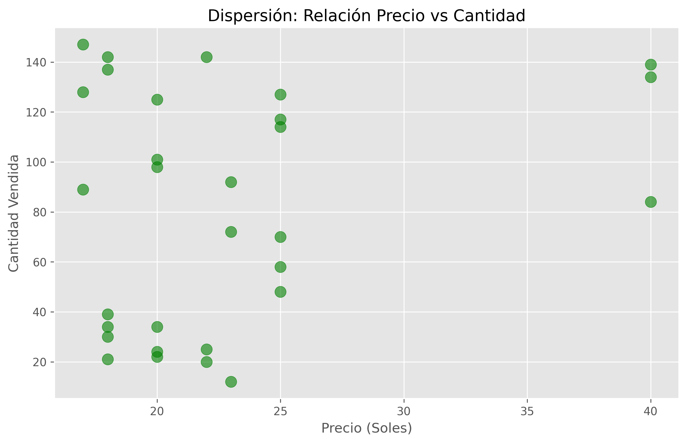

# 🌿 Análisis de Ventas

Este proyecto forma parte del **Trabajo Final 2 del curso de Módulos y Paquetes para Machine Learning** 

##  Objetivo
Aplicar los conocimientos de **NumPy, Pandas y Matplotlib** para analizar ventas, realizar cálculos estadísticos y visualizar resultados geográficos y por producto.

##  Visualizaciones Generadas
A continuación se muestran los análisis gráficos obtenidos:

### 1. Histograma de Ventas
Permite observar la distribución y frecuencia de los montos de venta en Soles.

### 2. Gráfico de Dispersión (Precio vs Cantidad)
Muestra la relación entre el costo unitario de los productos y el volumen de unidades vendidas.

## Tecnologías Utilizadas
* **Python 3.x**
* **Pandas**: Estructuración y limpieza de datos.
* **NumPy**: Cálculos estadísticos avanzados.
* **Matplotlib**: Generación de reportes visuales (PNG).

## Archivos del Proyecto
* `trabajofinal2.py`: Script principal con el código fuente.
* `ventas_misha_rastrera.csv`: Dataset exportado con 30 distritos y 5 ciudades.
* `*.png`: Gráficas de análisis de resultados.